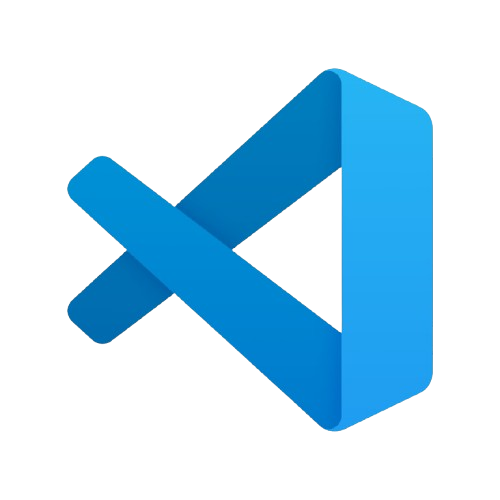
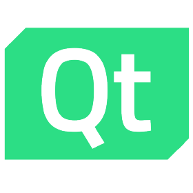

<h1 align="center">SpendTrack</h1>

  

 

    
    
    
    

## 📋 Description
SpendTrack is your go-to C++ financial tracker, letting you easily manage expenses, incomes, and budgets all in one place.ou can create a new transaction, keep track of your monthly estimated expenses, and view your spending habits according to different categories. With SpendTrack’s intuitive interface and clear reports, you’ll gain insights into your financial habits to make smarter money decisions.

## 🚀 Languages 
  
 
  
  

## 🔧 Tools 
  
 
  
   
    
     
    
    </a>
  
 
  
## 💼 Documents
+ [Presentation]()
+ [Documentation]()

## 👨🏻‍💻 Team Members
| **Name** | **Role** | **Grade** |
| :---:   | :---: | :---: |
| Veselina Varadeva | Scrum Trainer | 🟩 10V |
| Georgi Georgiev | Back-end developer | 🟩 10V |
| Georgi Stoyanov |  Back-end developer  | 🟩 10V  |
| Gabriela Encheva|  Back-end developer  | 🟩 10V  |

